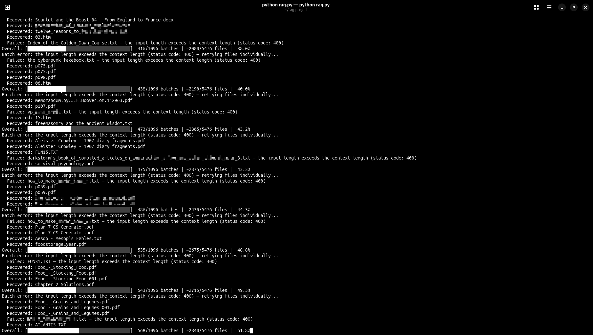

# RAG-Technique-V.1

> Index your personal files into a local LLM using **LlamaIndex + Ollama** — fully private, no cloud required.

---

## Overview

This guide walks you through setting up a local Retrieval-Augmented Generation (RAG) pipeline that lets you query your own documents using any Ollama-compatible model. The script handles batched indexing with checkpointing, graceful shutdown, disk space checks, and automatic fallback to the raw LLM when no relevant documents are found.

**Supported file types:** `.pdf` `.docx` `.txt` `.md` `.html` `.htm`

---

## Prerequisites

- [Ollama](https://ollama.com) installed and running
- Python 3.8+
- Your documents in a folder somewhere on disk

---

## Optional: Pre-processing Your Files

Before indexing, you may want to convert files into formats the script can ingest cleanly.

### Convert large PDFs to plain text

```bash
pip install marker-pdf
marker_single yourfile.pdf output_folder/
```

Marker also has a batch command built in:

```bash
marker "/home/USER/Documents/PATH" "/home/system/Documents/CONVERTED" --workers 4 
```

Update the paths above accordingly.

--workers 4 runs 4 parallel conversions at a time.

You can increase this, but watch your RAM since each worker loads a PDF into memory.

### Convert legacy `.doc` files to `.docx`

```bash
sudo apt install libreoffice -y
find "/DOCUMENTS/PATH/" -name "*.doc" -exec libreoffice --headless --convert-to docx {} --outdir {}_converted \;
```

### Convert images (`.jpg` / `.png` / `.bmp`) to searchable PDFs via OCR

```bash
sudo apt install tesseract-ocr imagemagick -y
pip install pytesseract pillow

find "/DOCUMENTS/PATH/" -name "*.jpg" -o -name "*.png" -o -name "*.bmp" | while read f; do
    tesseract "$f" "${f%.*}" pdf
done
```

---

## Setup

### 1. Install Python venv (if needed)

```bash
sudo apt install python3-full python3-venv -y
```

### 2. Create project folder and drop in your documents

```bash
mkdir rag-project
cd rag-project
mkdir your_docs
# Drop your files into your_docs/ — or point to an existing folder later in the script
```

### 3. Create and activate a virtual environment

```bash
python3 -m venv rag-env
source rag-env/bin/activate
```

> You should see `(rag-env)` at the start of your terminal prompt.

### 4. Install dependencies

```bash
pip install llama-index llama-index-llms-ollama llama-index-embeddings-ollama
```

### 5. Pull the embedding model

```bash
ollama pull nomic-embed-text
```

---

## Configuration

Create `rag.py` and paste the full script below. **Before running, update the two lines at the top:**

```python
DOCS_PATH = "/DOCUMENTS/PATH/"   # ← absolute path to your documents folder
MODEL_NAME = "MODEL_NAME"        # ← e.g. "llama3", "mistral", "gemma3"
```

Also update the model name near the bottom of the script in the fallback subprocess call:

```python
["ollama", "run", "MODEL_NAME"],  # ← same model name as above
```

---

## The Script

```python
import os
import shutil
import subprocess
import signal
import json
from datetime import datetime
from llama_index.core import VectorStoreIndex, SimpleDirectoryReader, StorageContext, load_index_from_storage
from llama_index.llms.ollama import Ollama
from llama_index.embeddings.ollama import OllamaEmbedding
from llama_index.core import Settings

# --- UPDATE THESE TWO LINES ---
DOCS_PATH = "/DOCUMENTS/PATH/"
MODEL_NAME = "MODEL_NAME"
# ------------------------------

EMBED_MODEL = "nomic-embed-text"
INDEX_PATH = "./saved_index"
TEMP_INDEX_PATH = "./saved_index_tmp"
LOG_FILE = "./skipped.log"
CHECKPOINT_FILE = "./checkpoint.json"
BATCH_SIZE = 5
MAX_FILE_SIZE_MB = 50
MIN_FREE_DISK_GB = 2
SUPPORTED_EXTENSIONS = ('.pdf', '.docx', '.txt', '.md', '.html', '.htm')

Settings.llm = Ollama(model=MODEL_NAME, request_timeout=120.0)
Settings.embed_model = OllamaEmbedding(model_name=EMBED_MODEL)

# ─── Graceful shutdown ────────────────────────────────────────────────────────
shutdown_requested = False

def handle_shutdown(signum, frame):
    global shutdown_requested
    print(f"\n\nShutdown requested — finishing current batch then stopping safely...")
    shutdown_requested = True

signal.signal(signal.SIGINT, handle_shutdown)

# ─── Disk space check ─────────────────────────────────────────────────────────
def check_disk_space():
    stat = shutil.disk_usage(os.path.dirname(os.path.abspath(INDEX_PATH)))
    free_gb = stat.free / (1024 ** 3)
    if free_gb < MIN_FREE_DISK_GB:
        print(f"WARNING: Only {free_gb:.1f}GB free disk space. Recommended minimum is {MIN_FREE_DISK_GB}GB.")
        print("Continue anyway? (y/n): ", end="")
        if input().strip().lower() != 'y':
            exit()
    else:
        print(f"Disk space OK: {free_gb:.1f}GB free.")

# ─── Logging ──────────────────────────────────────────────────────────────────
def log_skipped(files, reason):
    with open(LOG_FILE, 'a') as f:
        timestamp = datetime.now().strftime('%Y-%m-%d %H:%M:%S')
        for file in files:
            f.write(f"[{timestamp}] SKIPPED: {file}\n")
            f.write(f"           REASON:  {reason}\n\n")

# ─── Checkpoint ───────────────────────────────────────────────────────────────
def load_checkpoint():
    if os.path.exists(CHECKPOINT_FILE):
        with open(CHECKPOINT_FILE, 'r') as f:
            return set(json.load(f))
    return set()

def save_checkpoint(indexed_files):
    with open(CHECKPOINT_FILE, 'w') as f:
        json.dump(list(indexed_files), f)

# ─── Safe save ────────────────────────────────────────────────────────────────
def safe_save(index):
    index.storage_context.persist(persist_dir=TEMP_INDEX_PATH)
    if os.path.exists(INDEX_PATH):
        shutil.rmtree(INDEX_PATH)
    shutil.copytree(TEMP_INDEX_PATH, INDEX_PATH)
    shutil.rmtree(TEMP_INDEX_PATH)

# ─── Progress bar ─────────────────────────────────────────────────────────────
def overall_progress(current, total, bar_length=40):
    percent = current / total if total > 0 else 0
    filled = int(bar_length * percent)
    bar = '█' * filled + '░' * (bar_length - filled)
    files_done = min(current * BATCH_SIZE, total_files)
    total_str = str(total)
    current_str = str(current).rjust(len(total_str))
    files_done_str = str(files_done).rjust(len(str(total_files)))
    print(f'\rOverall: [{bar}] {current_str}/{total_str} batches | ~{files_done_str}/{total_files} files | {percent*100:5.1f}%', end='', flush=True)

# ─── Gather files ─────────────────────────────────────────────────────────────
check_disk_space()

all_files = []
skipped_size = 0
skipped_type = 0
for root, dirs, files in os.walk(DOCS_PATH):
    for file in files:
        full_path = os.path.join(root, file)
        if not file.lower().endswith(SUPPORTED_EXTENSIONS):
            skipped_type += 1
            continue
        size_mb = os.path.getsize(full_path) / (1024 * 1024)
        if size_mb > MAX_FILE_SIZE_MB:
            skipped_size += 1
            log_skipped([full_path], f"File size {size_mb:.1f}MB exceeds {MAX_FILE_SIZE_MB}MB limit")
            continue
        all_files.append(full_path)

# Sort smallest first for stability
all_files.sort(key=lambda x: os.path.getsize(x))

# Filter out already indexed files via checkpoint
indexed_files = load_checkpoint()
remaining_files = [f for f in all_files if f not in indexed_files]

total_files = len(all_files)
total_batches = (len(remaining_files) + BATCH_SIZE - 1) // BATCH_SIZE
already_done = len(indexed_files)

print(f"\nFound {total_files} files to index.")
print(f"Skipped {skipped_size} files over {MAX_FILE_SIZE_MB}MB.")
print(f"Skipped {skipped_type} unsupported file types.")
print(f"Already indexed: {already_done} files.")
print(f"Remaining: {len(remaining_files)} files | {total_batches} batches.\n")

# ─── Load or create index ─────────────────────────────────────────────────────
if os.path.exists(INDEX_PATH):
    print("Loading existing index...")
    storage_context = StorageContext.from_defaults(persist_dir=INDEX_PATH)
    index = load_index_from_storage(storage_context)
else:
    print("Creating new index...")
    index = None

# ─── Process batches ──────────────────────────────────────────────────────────
completed = 0
for i in range(0, len(remaining_files), BATCH_SIZE):
    if shutdown_requested:
        print("\nStopped safely. Progress has been saved.\n")
        break

    batch = remaining_files[i:i + BATCH_SIZE]
    overall_progress(completed, total_batches)

    try:
        documents = []
        for file in batch:
            documents += SimpleDirectoryReader(input_files=[file]).load_data()

        if index is None:
            index = VectorStoreIndex.from_documents(documents)
        else:
            for doc in documents:
                index.insert(doc)

        safe_save(index)
        indexed_files.update(batch)
        save_checkpoint(indexed_files)
        completed += 1

    except Exception as e:
        # Retry each file individually before giving up
        print(f"\nBatch error: {e} — retrying files individually...")
        for file in batch:
            try:
                docs = SimpleDirectoryReader(input_files=[file]).load_data()
                if index is None:
                    index = VectorStoreIndex.from_documents(docs)
                else:
                    for doc in docs:
                        index.insert(doc)
                safe_save(index)
                indexed_files.add(file)
                save_checkpoint(indexed_files)
                print(f"  Recovered: {os.path.basename(file)}")
            except Exception as e2:
                print(f"  Failed: {os.path.basename(file)} — {e2}")
                log_skipped([file], str(e2))
        completed += 1
        continue

overall_progress(total_batches, total_batches)
print(f"\n\nAll done! {len(indexed_files)} files indexed.\n")
print(f"Check {LOG_FILE} for any skipped files.\n")

# ─── Query engine ─────────────────────────────────────────────────────────────
query_engine = index.as_query_engine(
    similarity_top_k=3,
    response_mode="compact"
)

print("Ready! Type your questions (ctrl+c to quit)\n")
while True:
    question = input("You: ")
    try:
        response = query_engine.query(question)
        if not str(response).strip() or "empty response" in str(response).lower():
            raise ValueError("No relevant docs found")
        print(f"\nAssistant: {response}\n")
    except:
        result = subprocess.run(
            ["ollama", "run", "MODEL_NAME"],  # ← update this too
            input=question,
            capture_output=True,
            text=True,
            env={**os.environ, "OLLAMA_NOHISTORY": "1"}
        )
        print(f"\nAssistant: {result.stdout.strip()}\n")
```

---

## Running

```bash
python rag.py
```

### Resuming later

```bash
cd rag-project
source rag-env/bin/activate
python rag.py
```

The script saves a checkpoint after every batch — if it's interrupted, it picks up exactly where it left off.

---

## Tuning for Your Hardware

Batch size has the biggest impact on RAM usage. Adjust `BATCH_SIZE` in the script:

| RAM    | Recommended `BATCH_SIZE` |
|--------|--------------------------|
| 16 GB  | 5 (default)              |
| 32 GB  | 10                       |
| 64 GB  | 20–25                    |

**Tip for large PDFs:** On your first pass, leave `MAX_FILE_SIZE_MB = 50` to skip big files. Once everything else is indexed, lower `BATCH_SIZE` to `1` and re-run to handle the large files — they require significantly more RAM to process.

---

## How It Works

| Feature | Detail |
|---|---|
| **Checkpointing** | Saves progress after every batch; safe to cancel anytime with `Ctrl+C` |
| **Graceful shutdown** | Finishes the current batch before stopping |
| **Atomic saves** | Writes to a temp directory first, then swaps — no corrupted indexes |
| **Per-file retry** | If a batch fails, each file is retried individually before being skipped |
| **Skipped file log** | Any file that can't be indexed is logged to `skipped.log` with a reason |
| **Zero history** | Ollama fallback sessions use `OLLAMA_NOHISTORY=1` — nothing is persisted |
| **Fallback** | If no relevant documents are found, query falls back to the raw LLM |

---

## Files Generated

```
rag-project/
├── rag.py
├── saved_index/       # Vector index (auto-created)
├── checkpoint.json    # Tracks which files have been indexed
└── skipped.log        # Files that failed to index and why
```

---



---
